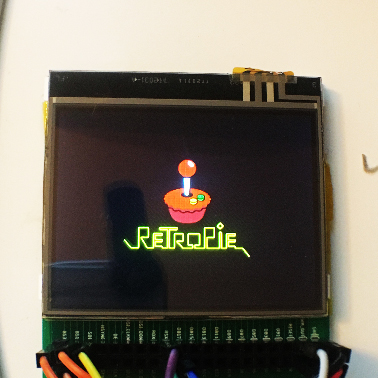
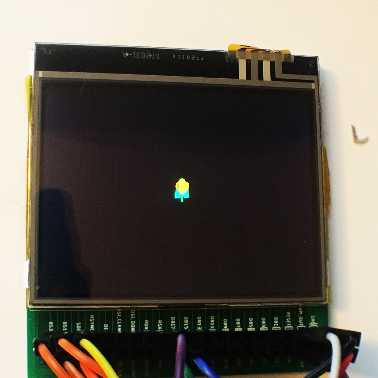

# ILI9342 Driver For Raspberry Pi
> This is a precompiled driver for the ILI9342 driver on 2.3" and 2.6" TFT LCD


### Pin Mapping
> This is a 4 IO SPI pin mapping for Raspberry Pi 2/3/Zero

| Function|RPI PIN |GPIO|
|----|----|----|
|RESET|22|GPIO25|
|CSX|24|CEO/GPIO8|
|SCL|23|SCLK/GPIO11|
|D/CX|18|GPIO24|
|SDI|19|MOSI/GPIO10|

***Notes**: sometimes you will find that the above pins do NOT have corresponding pins on the TFT ribbon cable. This is due to different naming convenstion from different manufacturers*

*Here is a list of possible pin names and swaps*

| Function|Possible Pin Name|
|----|----|
|RESET|RESET, RST|
|CSX|CS, CSX, CX|
|SCL|RS, RSX, RX|
|D/CX|DC, WR, WRX, WX|
|SDI|SDI|

## Pick a system
> Once you decide which OS you will be playing with the instructions are a little different

Grab the [driver file](fbcp-ili9342) and save it locally to you computer

### RetroPie
> Linux Distro



Drop the driver file into the ```/home/pi``` directory
SSH into your Pi

```shell
cd ..
sudo chmod +x fbcp-ili9342
```
Test the drive
```shell
sudo ./fbcp-ili9342
```
If all has gone well and you have your display running. Let's make sure this happens automagically on start up by editing ```rc.local``` file

```shell
sudo nano /etc/rc.local
```

Add this above the ```exit 0``` line, should look like below
```shell
sudo /home/pi/fbcp-ili9342 &

exit 0
```

Save and reboot

### Lakka
> Because Arch



Drop the driver file into the ```/storage``` directory
SSH into your Pi

```
chmod +x fbcp-ili9342
```

Test the drive
```shell
./fbcp-ili9342
```

If all has gone well and you have your display running. Let's make sure this happens automagically on start up by editing ```autostart.sh``` file

```shell
nano /storage/.config/autostart.sh
```

It will be an empy file. Simply add the line below
```shell
/storage/fbcp-ili9342 &
```

Save and reboot

### Get In Touch
> Find me on the internet and lets chat

[](https://github.com/32teeth)[](https://www.instagram.com/thirtytwoteeth/)[](https://www.facebook.com/messages/t/32teeth)[](https://twitter.com/eugeneyevhen)[](https://www.youtube.com/user/32teeth/)[](https://ca.linkedin.com/in/32teeth)[](https://www.paypal.com/cgi-bin/webscr?cmd=_s-xclick&hosted_button_id=4CXNRDT39KHBJ)
